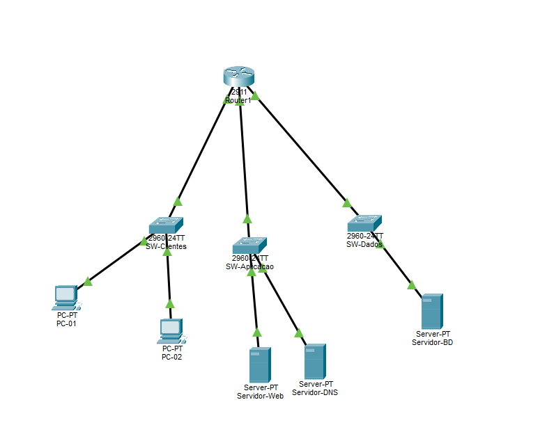

# Infraestrutura de Rede IPv6 — Simulação no Cisco Packet Tracer

> Projeto acadêmico desenvolvido no curso de **Tecnologia em Análise e Desenvolvimento de Sistemas (TADS)**.  
> Simula uma arquitetura de rede segmentada em três zonas utilizando **IPv6 nativo**, roteamento inter-VLAN e serviços de aplicação (HTTP + DNS).

---

## Topologia da Rede



---

## Arquitetura — Zonas de Segurança

A rede é dividida em **3 zonas isoladas**, interligadas por um roteador central:

| Zona | Sub-rede IPv6 | Switch | Dispositivos | Função |
|------|--------------|--------|--------------|--------|
| 🟢 **Pública (Clientes)** | `2001:db8:fade:100::/64` | SW-Clientes | PC-01, PC-02 | Usuários finais — obtêm IP via SLAAC |
| 🟡 **DMZ (Aplicação)** | `2001:db8:fade:200::/64` | SW-Aplicacao | Servidor-Web, Servidor-DNS | Serviços expostos à rede de clientes |
| 🔴 **Restrita (Dados)** | `2001:db8:fade:300::/64` | SW-Dados | Servidor-BD | Banco de dados — acesso controlado |

---

##  Dispositivos Utilizados

| Dispositivo | Modelo | Quantidade |
|-------------|--------|-----------|
| Roteador-Core | Cisco 2911 | 1 |
| Switches | Cisco 2960 | 3 |
| Computadores (Clientes) | PC-PT | 2 |
| Servidores | Server-PT | 3 |

---

##  Endereçamento IPv6

| Dispositivo | Endereço IPv6 | Tipo |
|-------------|--------------|------|
| Roteador G0/0 | `2001:db8:fade:100::1/64` | Gateway Clientes |  `2001:0db8:fade:0100:0000:0000:0000:0001`
| Roteador G0/1 | `2001:db8:fade:200::1/64` | Gateway DMZ |  `2001:0db8:fade:0200:0000:0000:0000:0001`
| Roteador G0/2 | `2001:db8:fade:300::1/64` | Gateway Dados |  `2001:0db8:fade:0300:0000:0000:0000:0001`
| Servidor-DNS | `2001:db8:fade:200::10/64` | Estático |  `2001:0db8:fade:0200:0000:0000:0000:0001`
| Servidor-Web | `2001:db8:fade:200::80/64` | Estático |  `2001:0db8:fade:0200:0000:0000:0000:0001`
| Servidor-BD | `2001:db8:fade:300::50/64` | Estático |  `2001:0db8:fade:0300:0000:0000:0000:0001`
| PC-01 / PC-02 | `2001:db8:fade:100::xxxx` | SLAAC (automático) |  
 
---

##  Serviços Configurados

### Servidor-Web
- Protocolo: **HTTP / HTTPS**
- Página customizada servida em `http://api.tads.local`

###  Servidor-DNS
- Registro **AAAA** configurado:
  - `api.tads.local` → `2001:db8:fade:200::80`

###  Servidor-BD
- Isolado na zona restrita
- Acessível apenas via roteamento interno

---

## Testes de Validação

### Teste 1 — Resolução de Nomes + Acesso Web
```
PC-01 > Web Browser > http://api.tads.local
```
**Resultado esperado:** Página customizada renderizada, comprovando:
- Consulta DNS AAAA bem-sucedida
- Roteamento G0/0 → G0/1 funcional

### Teste 2 — Roteamento para Zona de Dados
```
PC-02 > Command Prompt > ping 2001:db8:fade:300::50
```
**Resultado esperado:** Respostas ICMP do Servidor-BD, comprovando roteamento inter-zona.

---

## Estrutura do Repositório

```
 projeto-rede-ipv6
 ┣  README.md
 ┣  topologia.png
 ┗  projeto.pkt          ← Arquivo do Cisco Packet Tracer
```

---

## Como Reproduzir

1. Instale o **Cisco Packet Tracer v8.x** ou superior
2. Abra o arquivo `projeto.pkt`
3. Siga os passos de configuração da CLI do `Roteador-Core`
4. Execute os testes do Passo 6 para validar a infraestrutura

---

##  Tecnologias


(claude foi utilizado para ajudar a formatar o arquivo readme)


